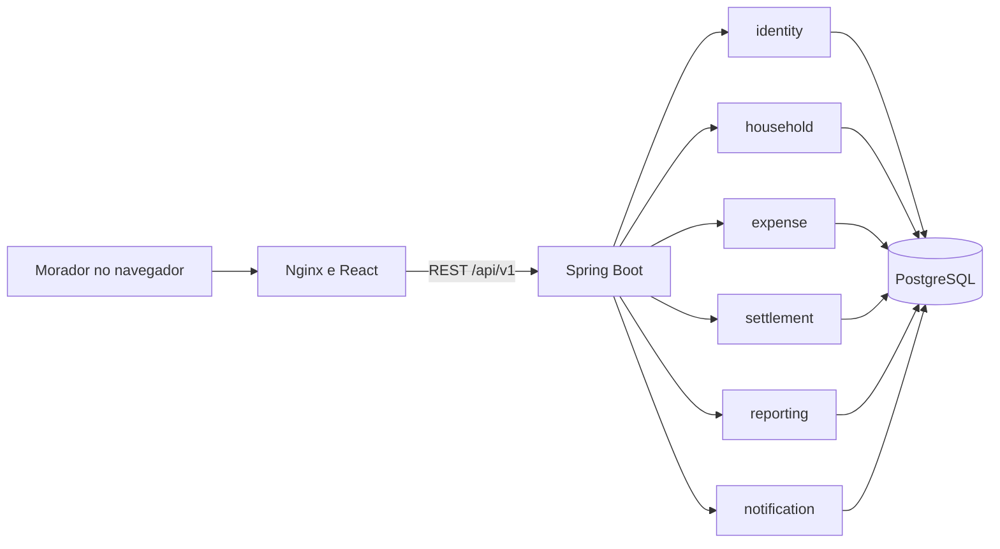
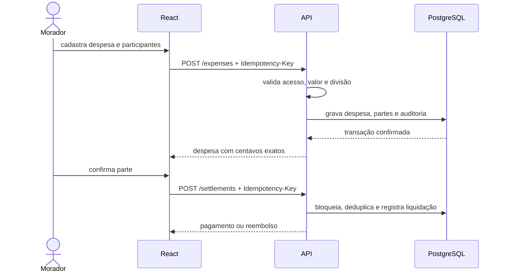

# Arquitetura do MVP

O CasaContas é um monólito modular: um único processo de backend, com limites explícitos entre funcionalidades, e uma aplicação web separada. Essa forma reduz o custo operacional do MVP sem misturar as regras financeiras com HTTP ou persistência.

## Limites do backend

Cada módulo pode conter `api`, `application`, `domain` e `infrastructure`. Controllers traduzem HTTP, serviços de aplicação orquestram casos de uso, o domínio protege invariantes e adaptadores acessam PostgreSQL ou criptografia. Entidades JPA permanecem dentro de `infrastructure`.

O pacote `shared` contém apenas capacidades transversais: usuário atual, erros, auditoria, configuração, segurança e paginação. Os testes ArchUnit impedem dependências proibidas e a saída de entidades JPA pela API.

## Fluxo financeiro principal

## Dados e precisão

- Valores usam `BigDecimal` e `NUMERIC(19,2)`; a moeda do MVP é BRL.
- Instantes técnicos usam UTC; vencimentos são datas civis e a casa mantém seu fuso.
- Cancelamento e remoção de membro são lógicos. Eventos financeiros e auditoria não são apagados.
- Chaves de idempotência persistidas evitam confirmação duplicada.

As decisões com consequência estrutural estão em [`adr/`](adr/).
