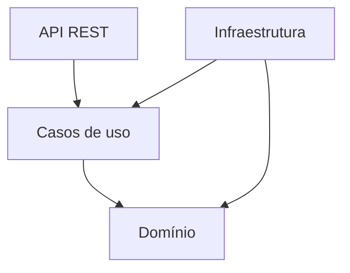
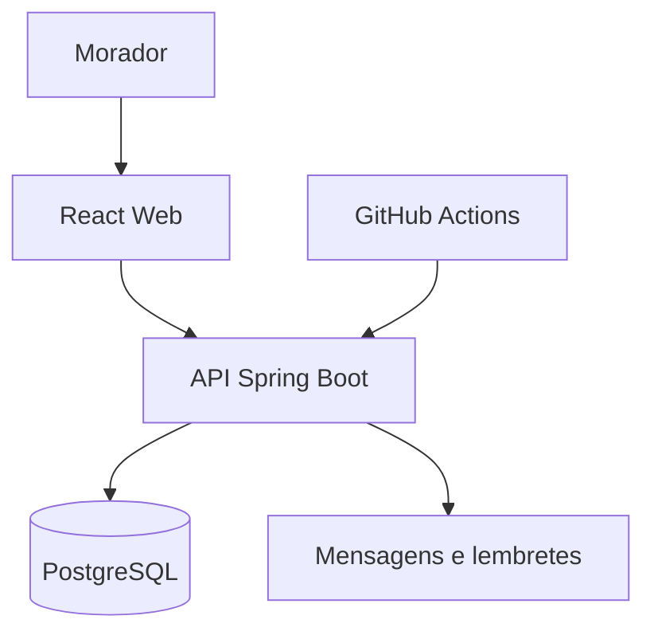
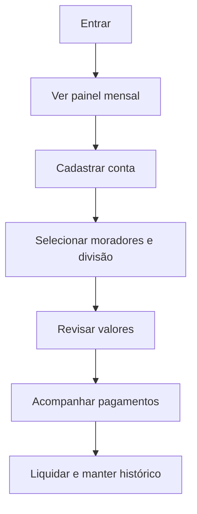
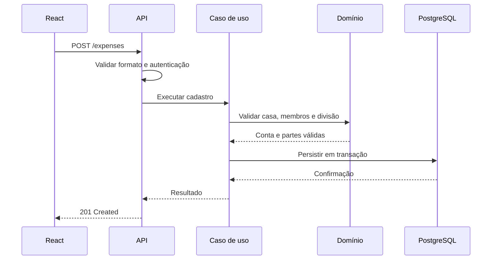
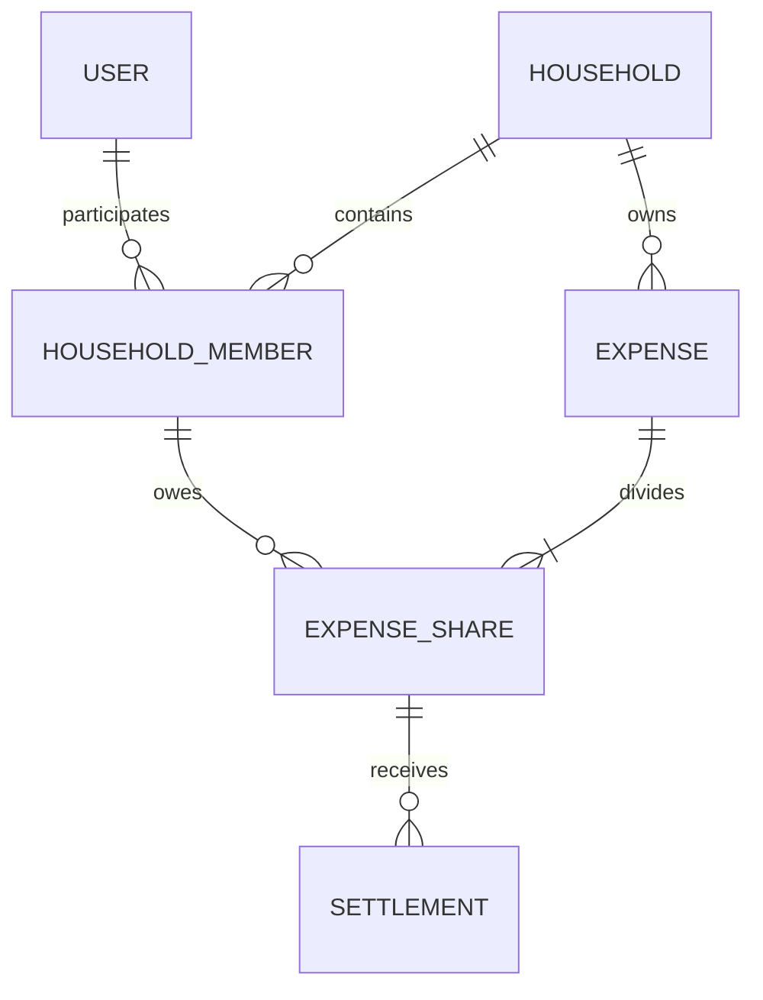
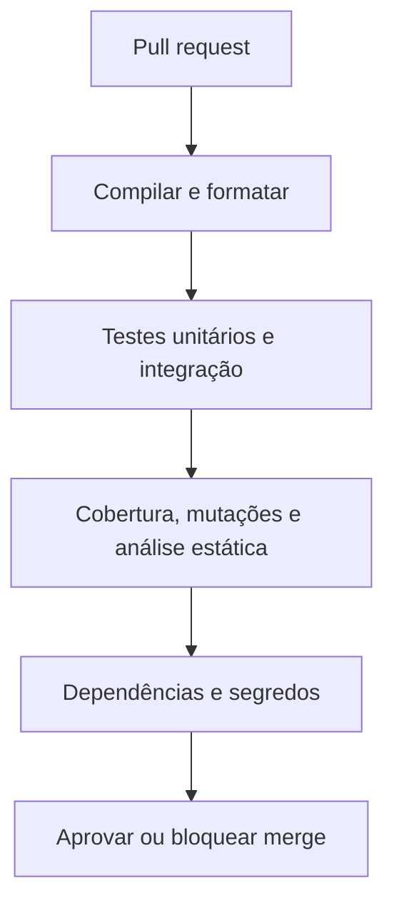
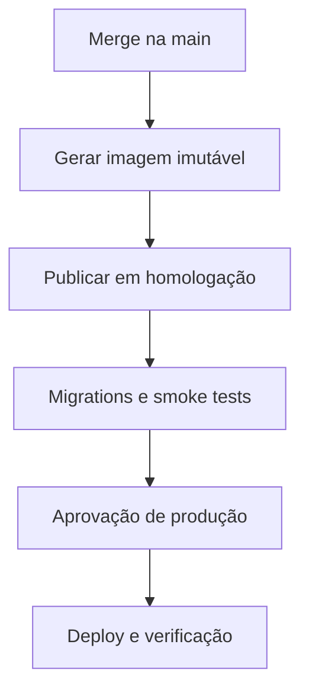

# CasaContas — Engenharia de Requisitos e Arquitetura

**Versão:** 0.1  
**Status:** proposta para revisão  
**Objetivo desta versão:** validar o produto, as regras e a arquitetura antes de iniciar o código

---

## 1. Visão do produto

O CasaContas será um sistema para organizar, dividir e acompanhar as despesas de uma casa compartilhada. O primeiro cenário real terá três moradores, mas o sistema será modelado para aceitar outras casas e quantidades de moradores sem precisar reescrever o backend.

O sistema deve responder com clareza a quatro perguntas:

1. Quais contas existem e quando vencem?
2. Quanto cada morador deve pagar?
3. Quem já pagou e quem ainda está pendente?
4. Qual é o resumo financeiro da casa no mês?

### 1.1 Problema atual

O controle feito por mensagens, fotos de comprovantes e cálculos manuais gera riscos de:

- esquecer vencimentos;
- dividir valores incorretamente;
- perder o histórico dos pagamentos;
- não saber quem ainda está devendo;
- precisar repetir cálculos e cobranças todos os meses.

### 1.2 Objetivo geral

Centralizar as contas domésticas e automatizar os cálculos de divisão, mantendo histórico, rastreabilidade e uma visão individual para cada morador.

### 1.3 Princípios do produto

- **Simplicidade:** registrar uma conta deve levar poucos passos.
- **Transparência:** todos devem entender de onde veio cada valor.
- **Exatidão:** nenhuma divisão pode perder ou criar centavos.
- **Rastreabilidade:** alterações e pagamentos importantes devem deixar histórico.
- **Evolução segura:** novas funções devem ser adicionadas sem quebrar as regras existentes.

---

## 2. Stakeholders e perfis

| Perfil | Responsabilidade |
|---|---|
| Proprietário da casa | Cria a casa, gerencia moradores e configurações |
| Administrador | Pode cadastrar, corrigir e cancelar contas da casa |
| Morador | Visualiza a casa, registra despesas permitidas e confirma seus pagamentos |
| Equipe de desenvolvimento | Mantém backend, frontend, testes, infraestrutura e documentação |

### 2.1 Permissões propostas

| Ação | Proprietário | Administrador | Morador |
|---|:---:|:---:|:---:|
| Gerenciar a casa | Sim | Não | Não |
| Convidar ou remover morador | Sim | Sim | Não |
| Cadastrar conta | Sim | Sim | Sim |
| Editar conta própria ainda não liquidada | Sim | Sim | Sim |
| Editar conta criada por outra pessoa | Sim | Sim | Não |
| Cancelar conta | Sim | Sim | Não |
| Confirmar o próprio pagamento | Sim | Sim | Sim |
| Confirmar pagamento de outro morador | Sim | Sim | Não |
| Visualizar dados da própria casa | Sim | Sim | Sim |

> Esta matriz é uma proposta e precisa ser aprovada antes da implementação da autorização.

---

## 3. Escopo por versão

### 3.1 MVP — obrigatório

- cadastro e autenticação de usuários;
- criação de uma casa;
- convite ou associação de moradores;
- perfis e permissões dentro da casa;
- cadastro de contas com valor, categoria, vencimento e observações;
- divisão igual entre moradores selecionados;
- divisão personalizada por valores;
- indicação de quem pagou a conta principal;
- acompanhamento da parte de cada morador;
- confirmação de pagamento/reembolso;
- painel mensal da casa e painel individual;
- filtros e histórico de contas;
- geração de mensagem de cobrança para copiar e enviar pelo WhatsApp;
- auditoria mínima das ações financeiras;
- API documentada;
- testes automatizados e pipeline de CI.

### 3.2 Versão 1.1 — próxima evolução

- contas recorrentes, como aluguel e internet;
- pagamentos parciais;
- anexos de faturas e comprovantes;
- lembretes automáticos;
- categorias personalizadas;
- exportação mensal em CSV ou PDF;
- recuperação de senha por e-mail.

### 3.3 Versão futura

- leitura de conta por foto com OCR;
- integração automática com WhatsApp;
- notificações por e-mail ou push;
- importação de movimentações;
- relatórios avançados e comparações mensais;
- suporte a mais de uma moeda.

### 3.4 Fora do MVP

- movimentar dinheiro ou realizar PIX pelo sistema;
- integração bancária;
- leitura automática de imagens;
- microsserviços;
- aplicativo móvel nativo;
- controle contábil ou fiscal.

---

## 4. Requisitos funcionais

Prioridades: **P0** é indispensável ao MVP, **P1** é importante após o núcleo e **P2** é evolução futura.

### 4.1 Identidade e acesso

| ID | Prioridade | Requisito |
|---|:---:|---|
| RF-001 | P0 | O usuário deve poder criar uma conta com nome, e-mail e senha. |
| RF-002 | P0 | O usuário deve poder entrar no sistema e renovar sua sessão com segurança. |
| RF-003 | P0 | O usuário autenticado deve acessar apenas as casas das quais participa. |
| RF-004 | P1 | O usuário deve poder encerrar todas as suas sessões ativas. |
| RF-005 | P1 | O usuário deve poder recuperar a senha por e-mail. |

### 4.2 Casa e moradores

| ID | Prioridade | Requisito |
|---|:---:|---|
| RF-010 | P0 | Um usuário deve poder criar uma casa e tornar-se seu proprietário. |
| RF-011 | P0 | Proprietário ou administrador deve poder convidar moradores. |
| RF-012 | P0 | O convite deve possuir prazo e não pode ser utilizado mais de uma vez. |
| RF-013 | P0 | O sistema deve associar a função de proprietário, administrador ou morador. |
| RF-014 | P0 | O sistema deve listar os moradores ativos da casa. |
| RF-015 | P0 | A remoção de um morador não deve apagar seu histórico financeiro. |

### 4.3 Contas e despesas

| ID | Prioridade | Requisito |
|---|:---:|---|
| RF-020 | P0 | O usuário autorizado deve cadastrar uma conta com título, valor total, categoria, vencimento e observação opcional. |
| RF-021 | P0 | A conta deve informar os moradores participantes da divisão. |
| RF-022 | P0 | O sistema deve dividir o valor igualmente entre os participantes selecionados. |
| RF-023 | P0 | O sistema deve permitir informar valores personalizados para cada participante. |
| RF-024 | P0 | O sistema deve registrar o morador que pagou a conta principal, quando já houver pagamento. |
| RF-025 | P0 | O sistema deve permitir que uma conta seja cadastrada antes do pagamento principal. |
| RF-026 | P0 | O usuário autorizado deve poder editar uma conta enquanto as regras de integridade permitirem. |
| RF-027 | P0 | O cancelamento deve preservar a conta e seu histórico, sem exclusão física. |
| RF-028 | P0 | O sistema deve classificar contas como pendentes, pagas, vencidas ou canceladas. |
| RF-029 | P1 | O sistema deve criar contas futuras a partir de uma recorrência mensal. |

### 4.4 Partes, pagamentos e reembolsos

| ID | Prioridade | Requisito |
|---|:---:|---|
| RF-030 | P0 | Cada participante deve possuir uma parte individual vinculada à conta. |
| RF-031 | P0 | O morador deve poder confirmar que liquidou a própria parte. |
| RF-032 | P0 | Proprietário ou administrador deve poder confirmar a parte de outro morador. |
| RF-033 | P0 | O sistema deve registrar data, valor e responsável pela confirmação. |
| RF-034 | P0 | Quando alguém pagar a conta completa, o sistema deve mostrar quanto os demais devem reembolsar a essa pessoa. |
| RF-035 | P0 | A conta deve ser considerada liquidada somente quando todas as partes exigíveis estiverem liquidadas. |
| RF-036 | P1 | O sistema deve aceitar pagamentos parciais sem ultrapassar o valor devido. |
| RF-037 | P1 | Uma confirmação incorreta deve ser estornada, nunca apagada. |

### 4.5 Painéis, histórico e comunicação

| ID | Prioridade | Requisito |
|---|:---:|---|
| RF-040 | P0 | O painel mensal deve exibir total da casa, total pago, total pendente e contas vencidas. |
| RF-041 | P0 | O painel individual deve exibir quanto o usuário deve, quanto já pagou e quanto deve receber. |
| RF-042 | P0 | O histórico deve aceitar filtros por mês, categoria, status e morador. |
| RF-043 | P0 | O sistema deve mostrar os detalhes e o histórico de alterações de uma conta. |
| RF-044 | P0 | O sistema deve gerar uma mensagem de cobrança com descrição, valor, vencimento e identificação da conta. |
| RF-045 | P1 | O sistema deve enviar lembretes automáticos antes e depois do vencimento. |
| RF-046 | P1 | O sistema deve exportar o fechamento mensal. |

---

## 5. Regras de negócio

| ID | Regra |
|---|---|
| RN-001 | Todo valor monetário deve ser positivo e armazenado com duas casas decimais. |
| RN-002 | A soma das partes deve ser exatamente igual ao valor total da conta. |
| RN-003 | Na divisão igual, centavos restantes devem ser distribuídos de forma determinística; nunca podem ser descartados. |
| RN-004 | Um morador não pode aparecer duas vezes na divisão da mesma conta. |
| RN-005 | Somente moradores ativos da mesma casa podem participar da conta. |
| RN-006 | Uma conta deve possuir pelo menos um participante. |
| RN-007 | Um usuário não pode acessar ou alterar dados de outra casa sem vínculo ativo. |
| RN-008 | A pessoa que pagou a conta completa não deve gerar dívida para si mesma; sua parte é considerada coberta pelo pagamento principal. |
| RN-009 | Os outros participantes passam a dever suas partes ao pagador da conta. |
| RN-010 | Não é permitido confirmar um valor superior ao saldo pendente. |
| RN-011 | Contas vencidas continuam pendentes; “vencida” representa uma condição calculada pela data. |
| RN-012 | Uma conta com movimentação financeira não deve ser excluída fisicamente. |
| RN-013 | Alterações de valor ou participantes após pagamentos exigem estorno ou fluxo de ajuste auditável. |
| RN-014 | A remoção de um morador bloqueia novas participações, mas mantém contas e pagamentos anteriores. |
| RN-015 | E-mail deve ser único por usuário no sistema. |
| RN-016 | Um usuário pode participar de mais de uma casa no futuro, ainda que o primeiro uso possua apenas uma. |
| RN-017 | Datas e instantes técnicos são armazenados em UTC; a apresentação usa o fuso configurado para a casa. |
| RN-018 | A moeda inicial será BRL e não poderá variar dentro da mesma conta. |

### 5.1 Exemplos de critérios de aceitação

#### CA-001 — divisão igual com centavos

```gherkin
Dado uma conta de R$ 100,00
E três moradores participantes
Quando a divisão igual for calculada
Então as partes devem ser R$ 33,34, R$ 33,33 e R$ 33,33
E a soma deve continuar sendo R$ 100,00
```

#### CA-002 — divisão personalizada inválida

```gherkin
Dado uma conta de R$ 120,00
Quando forem informadas partes de R$ 50,00, R$ 40,00 e R$ 20,00
Então o cadastro deve ser recusado
E o sistema deve informar que faltam R$ 10,00 na divisão
```

#### CA-003 — isolamento entre casas

```gherkin
Dado que um usuário pertence apenas à Casa A
Quando tentar consultar uma conta da Casa B
Então a API deve negar o acesso
E não deve revelar detalhes da conta da Casa B
```

#### CA-004 — pagamento completo por um morador

```gherkin
Dado uma conta dividida entre três moradores
E que um deles pagou o valor total ao fornecedor
Quando o pagamento principal for confirmado
Então a parte do pagador deve ficar coberta
E os outros moradores devem passar a dever suas partes ao pagador
```

#### CA-005 — idempotência da confirmação

```gherkin
Dado que uma parte já foi confirmada como paga
Quando a mesma requisição de confirmação for repetida
Então o sistema não deve registrar pagamento duplicado
E deve retornar o estado atual de forma consistente
```

---

## 6. Requisitos não funcionais

### 6.1 Segurança e privacidade

| ID | Requisito |
|---|---|
| RNF-001 | Senhas nunca devem ser armazenadas em texto puro. |
| RNF-002 | Autenticação deve usar tokens de curta duração e renovação controlada. |
| RNF-003 | A autorização deve ser validada no backend em toda operação protegida. |
| RNF-004 | Segredos devem vir de variáveis protegidas, nunca do repositório. |
| RNF-005 | Logs não podem expor senha, token ou dados pessoais desnecessários. |
| RNF-006 | A API deve validar tamanho, formato e domínio de todos os dados de entrada. |
| RNF-007 | Dependências devem passar por análise automática de vulnerabilidades. |
| RNF-008 | O sistema deve coletar apenas os dados pessoais necessários e permitir futura adequação à LGPD. |

### 6.2 Qualidade e manutenção

| ID | Requisito |
|---|---|
| RNF-010 | A arquitetura deve impedir que regras de negócio dependam de controller ou banco de dados. |
| RNF-011 | Alterações de banco devem ser versionadas por migrations. |
| RNF-012 | A API deve possuir contrato OpenAPI atualizado. |
| RNF-013 | Erros devem seguir um formato único e incluir um identificador de rastreamento. |
| RNF-014 | O build deve ser reproduzível localmente e no CI. |
| RNF-015 | O código deve passar por formatação, análise estática e testes antes do merge. |

### 6.3 Desempenho e confiabilidade

| ID | Requisito |
|---|---|
| RNF-020 | Em carga normal, 95% das operações simples devem responder em até 500 ms, desconsiderando a rede do usuário. |
| RNF-021 | Listagens devem ser paginadas e não podem carregar histórico ilimitado. |
| RNF-022 | Operações financeiras devem usar transações e proteger contra duplicidade. |
| RNF-023 | O sistema deve possuir health check para aplicação e banco. |
| RNF-024 | O banco de produção deve possuir backup e política de restauração testada. |

### 6.4 Observabilidade

- logs estruturados por requisição;
- correlation ID em chamadas e erros;
- métricas de saúde, latência e taxa de erro;
- trilha de auditoria para alterações financeiras;
- ambientes de desenvolvimento, teste, homologação e produção separados.

---

## 7. Arquitetura proposta

### 7.1 Estilo arquitetural

Será usado um **monólito modular**, com organização por funcionalidade e limites claros entre domínio, aplicação e infraestrutura.

Motivos:

- entrega inicial mais rápida;
- execução e deploy simples;
- transações financeiras consistentes;
- testes mais fáceis de executar;
- custo de infraestrutura menor;
- possibilidade de separar módulos no futuro, caso exista necessidade real.

Não serão usados microsserviços no MVP.

### 7.2 Tecnologias propostas

| Camada | Tecnologia |
|---|---|
| Backend | Java 21 LTS e Spring Boot 4.x |
| API | REST/JSON com OpenAPI |
| Persistência | Spring Data JPA/Hibernate |
| Banco | PostgreSQL |
| Migrations | Flyway |
| Segurança | Spring Security e JWT com refresh token |
| Testes | JUnit, AssertJ, Mockito, MockMvc e Testcontainers |
| Qualidade | JaCoCo, PIT, Checkstyle/Spotless, SpotBugs e análise de dependências |
| Build | Maven Wrapper |
| Contêiner | Docker |
| CI/CD | GitHub Actions |
| Frontend futuro | TypeScript, React e Vite |

> As versões exatas devem ser travadas no início da implementação e atualizadas por processo controlado.

### 7.3 Módulos do backend

```text
identity        usuários, login, tokens e sessões
household       casas, convites, moradores e permissões
expense         contas, categorias, divisões e recorrências
settlement      pagamentos, reembolsos e estornos
reporting       painéis, saldos, histórico e exportações
notification    mensagens e lembretes
shared          erros, auditoria, segurança e utilitários realmente comuns
```

Cada módulo seguirá esta divisão:

```text
api             controllers, requests, responses e contrato HTTP
application     casos de uso e controle de transações
domain          entidades, value objects, regras e portas
infrastructure  JPA, integrações, configuração e adaptadores
```

### 7.4 Regra de dependência



O domínio não conhece Spring MVC, banco de dados, JSON ou serviços externos. Essa separação permite testar as regras sem iniciar a aplicação inteira.

### 7.5 Contexto do sistema



No MVP, o componente de mensagens apenas gera o texto para compartilhamento. O envio automático fica desacoplado para uma versão posterior.

### 7.6 Fluxo principal do usuário



### 7.7 Fluxo técnico para cadastrar uma conta



### 7.8 Modelo conceitual de dados do MVP



Entidades principais:

| Entidade | Responsabilidade |
|---|---|
| User | Identidade global do usuário |
| Household | Casa e suas configurações |
| HouseholdMember | Vínculo, papel e estado do usuário dentro da casa |
| Expense | Conta principal, valor, data, categoria e estado |
| ExpenseShare | Responsabilidade individual de cada participante |
| Settlement | Pagamento, reembolso ou estorno auditável |
| AuditEvent | Registro das mudanças sensíveis |

### 7.9 Convenções da API

- prefixo `/api/v1`;
- recursos no plural;
- paginação em todas as listagens;
- UUIDs como identificadores externos;
- valores monetários representados por decimal, nunca `double`;
- datas civis em ISO 8601 e instantes em UTC;
- respostas de erro padronizadas;
- `Idempotency-Key` nas confirmações financeiras;
- versionamento explícito de contrato;
- OpenAPI gerado e validado no CI.

---

## 8. Estratégia de testes e TDD

### 8.1 TDD como processo

Para cada regra de negócio:

1. **Red:** escrever um teste que representa o comportamento e confirmar que ele falha pelo motivo esperado.
2. **Green:** implementar somente o necessário para o teste passar.
3. **Refactor:** melhorar o código mantendo todos os testes verdes.

O commit ou a pull request deve mostrar testes ligados ao requisito e à regra de negócio implementados.

### 8.2 Pirâmide de testes

| Nível | Objetivo | Dependências reais |
|---|---|---|
| Testes de domínio | Divisões, saldos, estados e permissões | Nenhuma infraestrutura |
| Testes de caso de uso | Orquestração, transações e respostas | Portas simuladas quando apropriado |
| Testes de persistência | Mapeamentos, constraints e queries | PostgreSQL real via Testcontainers |
| Testes de API | Validação, autorização, JSON e status HTTP | Aplicação iniciada e banco de teste |
| Testes de contrato | Garantir compatibilidade com o frontend | Contrato OpenAPI |
| Smoke test | Confirmar ambiente publicado | Serviço e banco de homologação |

### 8.3 Como validar os testes de verdade

- Testes de integração usarão PostgreSQL via Testcontainers; H2 não substituirá o banco real.
- Um teste deve falhar quando a regra protegida for propositalmente quebrada.
- PIT Mutation Testing será aplicado ao domínio financeiro para detectar testes que passam sem validar comportamento.
- Testes negativos cobrirão acesso indevido, duplicidade, arredondamento, valores inválidos e concorrência.
- O CI proibirá testes ignorados sem justificativa explícita.
- Relatórios de testes e cobertura serão publicados como artefatos do pipeline.
- Testes instáveis devem ser corrigidos; repetir automaticamente até passar não será solução.
- Relógio, UUID e integrações externas serão controláveis nos testes.

### 8.4 Metas de qualidade propostas

- 100% das regras financeiras críticas cobertas por testes de comportamento;
- cobertura global mínima de 80% de linhas e 70% de branches;
- mutation score mínimo inicial de 70% no domínio, aumentando com a maturidade;
- nenhuma vulnerabilidade crítica conhecida em dependências;
- nenhuma migration sem teste de inicialização;
- nenhuma pull request com build, análise estática ou testes falhando.

> Cobertura é um alarme, não uma prova isolada de qualidade. Os critérios de aceitação e o mutation testing verificam se os testes realmente protegem comportamentos.

---

## 9. CI/CD e entrega de software

### 9.1 Estratégia Git

- branch principal protegida: `main`;
- branches curtas por funcionalidade;
- pull request obrigatória;
- commits pequenos e relacionados a requisitos;
- revisão e pipeline verde antes do merge;
- releases com versionamento semântico.

### 9.2 Pipeline de pull request



Etapas obrigatórias:

1. checkout e validação do Maven Wrapper;
2. compilação com versão fixa do Java;
3. verificação de formatação;
4. testes unitários;
5. testes de integração com PostgreSQL;
6. cobertura JaCoCo;
7. mutation testing do domínio crítico;
8. análise estática;
9. análise de dependências e segredos;
10. empacotamento da aplicação;
11. publicação dos relatórios de qualidade.

### 9.3 Pipeline de entrega



Regras de entrega:

- o mesmo artefato aprovado em homologação deve seguir para produção;
- migrations devem rodar de forma controlada antes da nova versão receber tráfego;
- produção exige aprovação manual no início do projeto;
- falha de health check impede a conclusão do deploy;
- rollback deve reutilizar uma versão anterior conhecida;
- configuração e segredos pertencem ao ambiente, não à imagem.

---

## 10. Definição de pronto

Uma funcionalidade só estará pronta quando:

- estiver ligada a um requisito e critérios de aceitação;
- regra de negócio tiver sido desenvolvida com TDD;
- testes unitários, integração e API necessários estiverem passando;
- testes tiverem sido validados por mutação quando a regra for crítica;
- migration tiver sido criada e validada, se houver banco;
- autorização tiver sido verificada;
- contrato OpenAPI e documentação estiverem atualizados;
- logs não expuserem informações sensíveis;
- análise estática e segurança estiverem aprovadas;
- pull request tiver sido revisada;
- comportamento tiver sido verificado em homologação.

---

## 11. Plano de implementação após aprovação

### Fase 0 — fundação

- repositório e convenções;
- projeto Spring Boot;
- PostgreSQL local com Docker;
- migrations;
- tratamento de erros;
- observabilidade básica;
- pipeline inicial;
- arquitetura verificada por testes.

### Fase 1 — identidade e casa

- usuários e autenticação;
- casas, vínculos, convites e permissões;
- testes de isolamento entre casas.

### Fase 2 — núcleo financeiro

- despesas e partes;
- divisão igual e personalizada;
- pagamento principal, reembolso e liquidação;
- idempotência, concorrência e auditoria.

### Fase 3 — consultas e comunicação

- painel mensal e individual;
- filtros e histórico;
- mensagem de cobrança para WhatsApp.

### Fase 4 — frontend e entrega

- contrato consumido pelo React;
- testes de contrato;
- homologação;
- segurança e publicação.

---

## 12. Decisões que precisam de aprovação

| Tema | Recomendação atual | Alternativa |
|---|---|---|
| Autenticação no MVP | Cada morador possui sua conta | Um único administrador controla tudo |
| Cadastro de moradores | Convite por código/link | Administrador cria todos manualmente |
| Quem cadastra despesas | Todos os moradores | Apenas proprietário/administrador |
| Divisão no MVP | Igual e valores personalizados | Incluir porcentagem já no MVP |
| Pagamentos parciais | Versão 1.1 | Incluir no MVP |
| Contas recorrentes | Versão 1.1 | Incluir no MVP |
| WhatsApp no MVP | Gerar mensagem para copiar | Envio automático desde o início |
| Versão Java | Java 21 LTS | Manter Java 17 |
| Deploy inicial | Homologação automática e produção manual | Apenas deploy manual |

## 13. Questões abertas

1. Cada um dos três moradores terá login próprio?
2. Todos poderão cadastrar despesas ou somente você?
3. Uma conta só será registrada depois de alguém pagá-la, ou também antes do vencimento?
4. Pagamentos parciais precisam existir desde o MVP?
5. Aluguel e internet recorrentes precisam ser automáticos já na primeira versão?
6. No MVP, basta gerar a mensagem de cobrança ou o envio ao WhatsApp precisa ser automático?
7. Você quer que o sistema possa atender outras casas no futuro ou será exclusivamente para o seu apartamento?

---

## 14. Critério de aprovação deste documento

O documento será considerado aprovado quando:

- escopo do MVP estiver confirmado;
- permissões dos moradores estiverem definidas;
- regras de pagamento e reembolso estiverem claras;
- questões abertas estiverem respondidas;
- arquitetura e estratégia de testes forem aceitas.

Somente depois dessa aprovação será produzido o prompt operacional para o Codex implementar o backend em etapas verificáveis.
